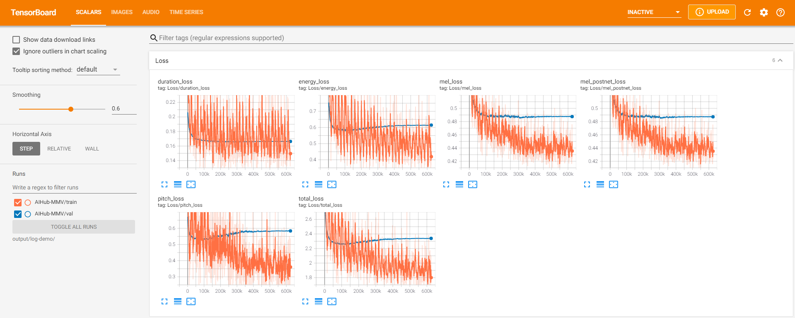
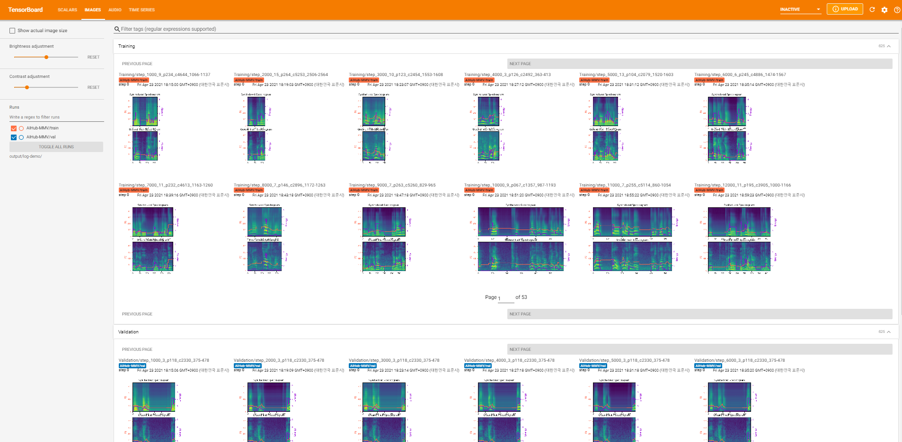
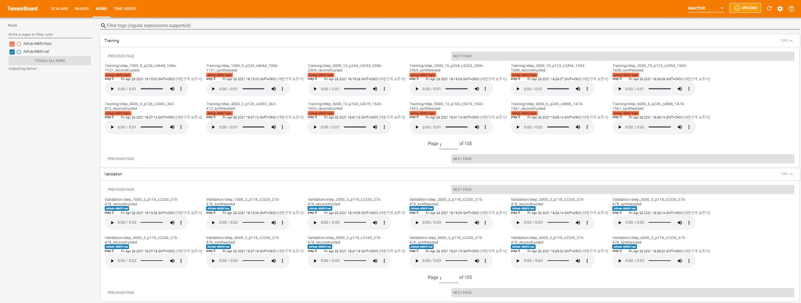

# Emotional-FastSpeech2 - PyTorch Implementation

## Contributions

1. **`Non-autoregressive Emotional TTS`**: This project aims to provide a cornerstone for future research and application on a non-autoregressive emotional TTS.
2. **`Annotated Data Processing`**: This project shed light on how to handle the new dataset, even with a different language, for the successful training of non-autoregressive emotional TTS.
3. **`Korean TTS`**: Especially, this project gives a broad view of treating Korean for the non-autoregressive TTS where the additional data processing must be considered under the language-specific features (e.g., training Montreal Forced Aligner with your own language and dataset). Please closely look into `text/`.

## Model Architecture

<p align="center">
    
</p>

<p align="center">
    
</p>

This project follows the basic conditioning paradigm of auxiliary inputs in addition to text input. As presented in [Emotional End-to-End Neural Speech synthesizer](https://arxiv.org/pdf/1711.05447.pdf), emotion embedding is conditioned in utterance level. Based on the dataset, emotion, arousal, and valence are employed for the embedding. They are first projected in subspaces and concatenated channel-wise to keep the dependency among each other. The concatenated embedding is then passed through a single linear layer with ReLU activation for the fusion, comsumed by the decoder to synthesize speech in given emotional conditions. In this project, FastSpeech2 is adapted as a base multi-speaker TTS framework, so it would be helpful to read [the paper](https://arxiv.org/abs/2006.04558) and [code](https://github.com/ming024/FastSpeech2) first.

# Dependencies

Please install the python dependencies given in `requirements.txt`.

```bash
pip3 install -r requirements.txt
```

# Synthesize Using Pre-trained Model

Not permitted to share pre-trained model publically due to the copyright of [AIHub Multimodal Videon AI datasets](https://www.aihub.or.kr/aidata/137).

# Train

## Preparation

1. Download [AIHub Multimodal Videon AI datasets](https://www.aihub.or.kr/aidata/137) and set `corpus_path` in `config/AIHub-MMV/preprocess.yaml`. You must get the permission to download the dataset.
2. Since the dataset contains raw videos, you need to convert and split each video clip into a audio utterance. For that, the following script will convert files from `.mp4` to `.wav` and then split each clip based on the `.json` file (metadata). It also builds `filelist.txt` and `speaker_info.txt`.
   ```bash
   python3 prepare_data.py --extract_audio -p config/AIHub-MMV/preprocess.yaml
   ```
3. Update `corpus_path` to the preprocessed data path, e.g., from `AIHub-MMV` to `AIHub-MMV_preprocessed`.

## Preprocess

1. With the prepared dataset, set up some prerequisites. The following command will process the audios and transcripts. The transcripts are normalized to grapheme of Korean by `korean_cleaners` in `/text/cleaners.py`. The results will be located at `raw_path` defined in `config/AIHub-MMV/preprocess.yaml`.

   ```bash
   python3 prepare_align.py config/AIHub-MMV/preprocess.yaml
   ```
2. As in FastSpeech2, [Montreal Forced Aligner](https://montreal-forced-aligner.readthedocs.io/en/latest/) (MFA) is used to obtain the alignments between the utterances and the phoneme sequences. Download and set up the environment to use MFA following the [official document](https://montreal-forced-aligner.readthedocs.io/en/latest/installation.html). The version used in this project is `2.0.0a13`.
   You can get alignments by either training MFA from scratch or using pre-trained model. Note that the training MFA may take several hours or days, depending on the corpus size.

   ### Train MFA from scratch

   To train MFA, grapheme-phoneme dictionary that covers all the words in the dataset is required. Following command will generate such dictionary in `lexicon/`.


   ```bash
   python3 prepare_data.py --extract_lexicon -p config/AIHub-MMV/preprocess.yaml
   ```

   After that, train MFA.

   ```bash
   mfa train ./raw_data/AIHub-MMV/clips lexicon/aihub-mmv-lexicon.txt preprocessed_data/AIHub-MMV/TextGrid --output_model_path montreal-forced-aligner/aihub-mmv-aligner --speaker_characters prosodylab -j 8 --clean
   ```

   It will generates both TextGrid in `preprocessed_data/AIHub-MMV/TextGrid/` and trained models in `montreal-forced-aligner/`. See [official document](https://montreal-forced-aligner.readthedocs.io/en/latest/aligning.html#align-using-only-the-data-set) for the details.

   ### Using Pre-trained Models

   If you want to re-align the dataset using the extracted lexicon dictionary and trained MFA models from the previous step, run the following command.

   ```bash
   mfa align ./raw_data/AIHub-MMV/clips lexicon/aihub-mmv-lexicon.txt montreal-forced-aligner/aihub-mmv-aligner.zip preprocessed_data/AIHub-MMV/TextGrid --speaker_characters prosodylab -j 8 --clean
   ```

   It will generates TextGrid in `preprocessed_data/AIHub-MMV/TextGrid/`. See [official document](https://montreal-forced-aligner.readthedocs.io/en/latest/aligning.html#align-using-pretrained-models) for the details.
3. Finally, run the preprocessing script. It will extract and save duration, energy, mel-spectrogram, and pitch in `preprocessed_data/AIHub-MMV/` from each audio.

   ```bash
   python3 preprocess.py config/AIHub-MMV/preprocess.yaml
   ```

## Model Training

Now you have all the prerequisites! Train the model using the following command:

```bash
python3 train.py -p config/AIHub-MMV/preprocess.yaml -m config/AIHub-MMV/model.yaml -t config/AIHub-MMV/train.yaml
```

# Inference

To synthesize a single speech, try

```bash
python3 synthesize.py --text "YOUR_DESIRED_TEXT" --speaker_id SPEAKER_ID --emotion_id EMOTION_ID --arousal AROUSAL --valence VALENCE --restore_step STEP --mode single -p config/AIHub-MMV/preprocess.yaml -m config/AIHub-MMV/model.yaml -t config/AIHub-MMV/train.yaml
```

All ids can be found in dictionary files (json files) in `preprocessed_data/AIHub-MMV/`, and the generated utterances will be put in `output/result/AIHub-MMV`.

Batch inference is also supported, try

```bash
python3 synthesize.py --source preprocessed_data/AIHub-MMV/val.txt --restore_step STEP --mode batch -p config/AIHub-MMV/preprocess.yaml -m config/AIHub-MMV/model.yaml -t config/AIHub-MMV/train.yaml
```

to synthesize all utterances in `preprocessed_data/AIHub-MMV/val.txt`.

# TensorBoard

Use

```bash
tensorboard --logdir output/log
```

to serve TensorBoard on your localhost. The loss curves, synthesized mel-spectrograms, and audios are shown.

<p align="center">
    
</p>

<p align="center">
    
</p>

<p align="center">
    
</p>

# Notes

### Implementation Issues

* Since the separator is learned only with 'sp' by the MFA's nature ([official document](https://montreal-forced-aligner.readthedocs.io/en/latest/data_format.html#transcription-normalization-and-dictionary-lookup)), spacing becomes a critical issue. Therefore, after text normalizing, the spacing is polished using the third-party module. The candidates were [PyKoSpacing](https://github.com/haven-jeon/PyKoSpacing) and [QuickSpacer](https://github.com/psj8252/quickspacer), but the latter is selected due to its high accuracy (fewer errors than PyKoSpacing).
* Some incorrect transcriptions can be fixed manually from `preparation/aihub_mmv_fixed.txt` during run of `prepare_align.py`. Even afther that, you can still expand `preparation/aihub_mmv_fixed.txt` with additional corrections and run the following command to apply them. It will update raw text data and `filelist.txt` in `raw_path`, and lexicon dictionary in `lexicon/`.

  ```bash
  python3 prepare_data.py --apply_fixed_text -p config/AIHub-MMV/preprocess.yaml
  ```

  Note that it should be done after at least once running of `prepare_align.py` and before MFA aligning.
* Also, some incorrect emotion labelings are fixed manually such as out of ranged value for either arousal or valence. These must be updated to build efficient emotion embedding space.
* I emperically found that `TextGrid` extracted from the training process is worsely aligned than that of re-aligned using trained model after the first training. I'm not sure about the reason, but I can confirm that it's better to re-align the dataset using your trained model after finishing the first training especially when there are too many unaligned corpora. Or you can also enlarge the `beam` and `retry_beam` following this [issue](https://github.com/MontrealCorpusTools/Montreal-Forced-Aligner/issues/240#issuecomment-791172411) and [official document](https://montreal-forced-aligner.readthedocs.io/en/latest/configuration_align.html#global-options) to get more aligned corpus with less accuracy.

### Training with your own dataset (own language)

* First, you need to transliterate the dataset by fitting `normalize()` function in `text/korean.py` and dictionary in `text/korean_dict.py`. If you are interested in adapting another language, you may need to prepare a grapheme-to-phoneme convertor of the language.
* Get the files that have the words to be manually checked by following command. Results will be saved at `corpus_path/nonkr.txt`.

  ```bash
  python3 prepare_data.py --extract_nonkr -p config/AIHub-MMV/preprocess.yaml
  ```

  Based on it, prepare the the correction filelist in `preparation/` just like `aihub_mmv_fixed.txt`.
* Then, follow the Train section start from Preprocess.
* As an example, you can apply English emotional dataset (e.g, [IEMOCAP](https://sail.usc.edu/iemocap/) database), including all other languages, as described above.

# References

* [ming024&#39;s FastSpeech2](https://github.com/ming024/FastSpeech2) (version after 2021.02.26 updates)
* [HGU-DLLAB&#39;s Korean-FastSpeech2-Pytorch](https://github.com/HGU-DLLAB/Korean-FastSpeech2-Pytorch)
* [hccho2&#39;s Tacotron2-Wavenet-Korean-TTS](https://github.com/hccho2/Tacotron2-Wavenet-Korean-TTS)
* [carpedm20&#39; multi-speaker-tacotron-tensorflow](https://github.com/carpedm20/multi-speaker-tacotron-tensorflow)
