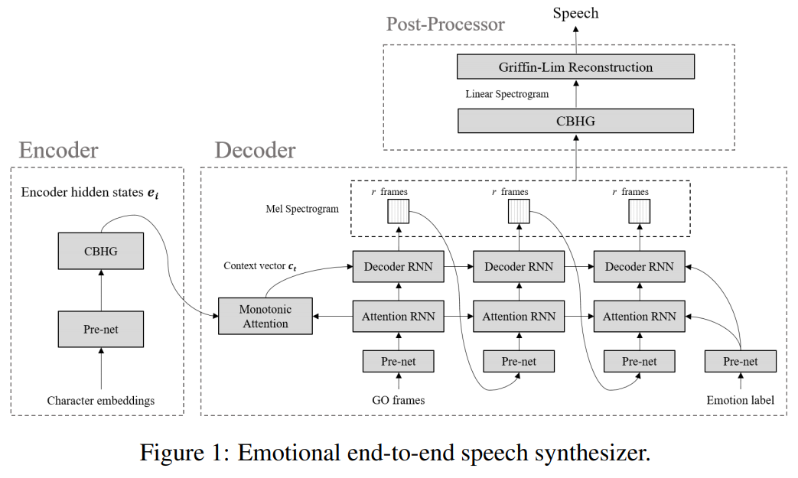
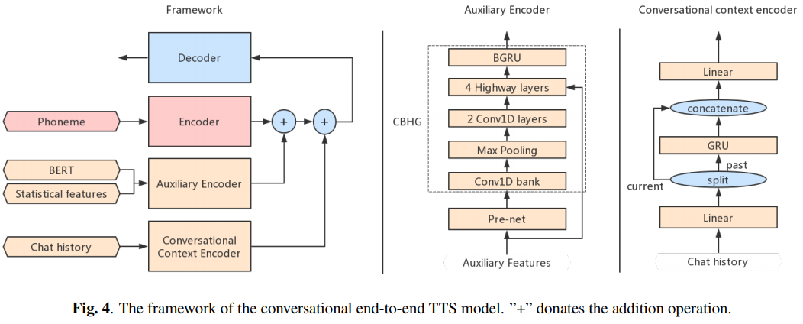

# Expressive-FastSpeech2 - PyTorch Implementation

## Contributions

1. **`Non-autoregressive Expressive TTS`**: This project aims to provide a cornerstone for future research and application on a non-autoregressive expressive TTS including `Emotional TTS` and `Conversational TTS`. For datasets, [AIHub Multimodal Video AI datasets](https://www.aihub.or.kr/aidata/137) and [IEMOCAP database](https://sail.usc.edu/iemocap/) are picked for Korean and English, respectively.

    **Note**: If you are interested in [GST-Tacotron](https://arxiv.org/abs/1803.09017) or [VAE-Tacotron](https://arxiv.org/abs/1812.04342) like expressive stylistic TTS model but under non-autoregressive decoding, you may also be interested in [STYLER](https://arxiv.org/abs/2103.09474) [[demo](https://keonlee9420.github.io/STYLER-Demo/), [code](https://github.com/keonlee9420/STYLER)].

2. **`Annotated Data Processing`**: This project shed light on how to handle the new dataset, even with a different language, for the successful training of non-autoregressive emotional TTS.
3. **`English and Korean TTS`**: In addition to English, this project gives a broad view of treating Korean for the non-autoregressive TTS where the additional data processing must be considered under the language-specific features (e.g., training Montreal Forced Aligner with your own language and dataset). Please closely look into `text/`. 
4. **`Adopting Own Language`**: For those who are interested in adapting other languages, please refer to the ["Training with your own dataset (own language)" section](https://github.com/keonlee9420/Expressive-FastSpeech2/tree/categorical#training-with-your-own-dataset-own-language) of the [categorical branch](https://github.com/keonlee9420/Expressive-FastSpeech2/tree/categorical).

## Repository Structure

In this project, FastSpeech2 is adapted as a base non-autoregressive multi-speaker TTS framework, so it would be helpful to read [the paper](https://arxiv.org/abs/2006.04558) and [code](https://github.com/ming024/FastSpeech2) first (Also see [FastSpeech2 branch](https://github.com/keonlee9420/Expressive-FastSpeech2/tree/FastSpeech2)).

<p align="center">
    
</p>

1. `Emotional TTS`: Following branches contain implementations of the basic paradigm intorduced by [Emotional End-to-End Neural Speech synthesizer](https://arxiv.org/pdf/1711.05447.pdf).

    <p align="center">
        
    </p>

    - [categorical branch](https://github.com/keonlee9420/Expressive-FastSpeech2/tree/categorical): only conditioning categorical emotional descriptors (such as happy, sad, etc.)
    - [continuous branch](https://github.com/keonlee9420/Expressive-FastSpeech2/tree/continuous): conditioning continuous emotional descriptors (such as arousal, valence, etc.) in addition to categorical emotional descriptors
2. `Conversational TTS`: Following branch contains implementation of [Conversational End-to-End TTS for Voice Agent](https://arxiv.org/abs/2005.10438)

    <p align="center">
        
    </p>

    - [conversational branch](https://github.com/keonlee9420/Expressive-FastSpeech2/tree/conversational): conditioning chat history

## Citation

If you would like to use or refer to this implementation, please cite the repo.

```bash
@misc{lee2021expressive_fastspeech2,
  author = {Lee, Keon},
  title = {Expressive-FastSpeech2},
  year = {2021},
  publisher = {GitHub},
  journal = {GitHub repository},
  howpublished = {\url{https://github.com/keonlee9420/Expressive-FastSpeech2}}
}
```

## References

- [ming024's FastSpeech2](https://github.com/ming024/FastSpeech2) (Later than 2021.02.26 ver.)
- [HGU-DLLAB's Korean-FastSpeech2-Pytorch](https://github.com/HGU-DLLAB/Korean-FastSpeech2-Pytorch)
- [hccho2's Tacotron2-Wavenet-Korean-TTS](https://github.com/hccho2/Tacotron2-Wavenet-Korean-TTS)
- [carpedm20' multi-speaker-tacotron-tensorflow](https://github.com/carpedm20/multi-speaker-tacotron-tensorflow)