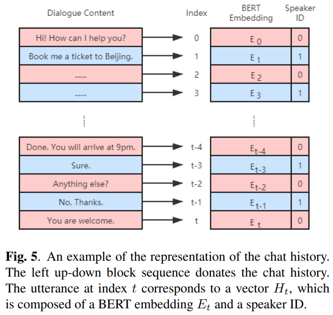
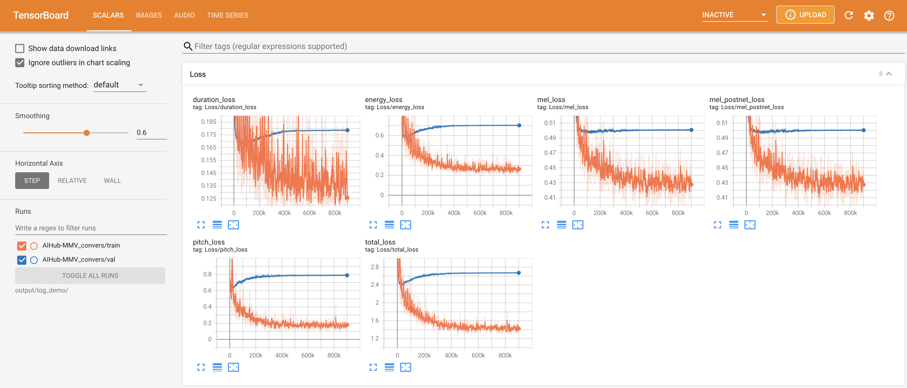
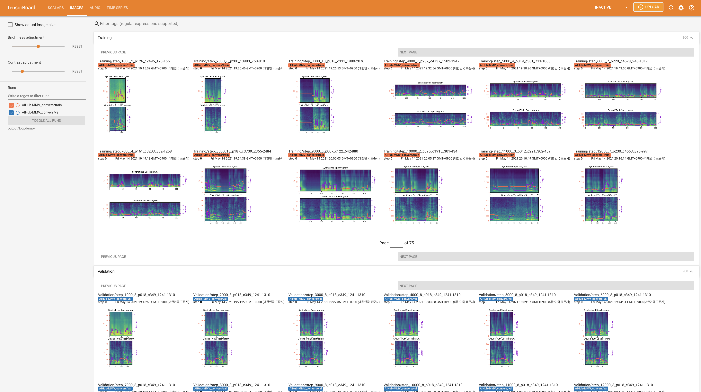
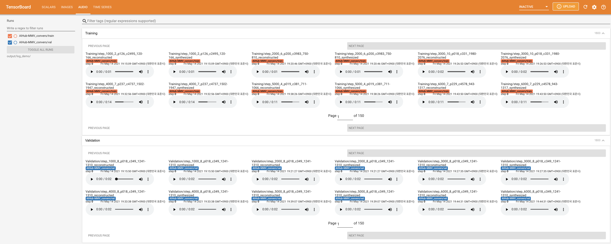

# Conversational-FastSpeech2 - PyTorch Implementation

<p align="center">
    
</p>

<p align="center">
    
</p>

<p align="center">
    
</p>

This project follows the structure presented in [Conversational End-to-End TTS for Voice Agent](https://arxiv.org/abs/2005.10438). Note that `auxiliary encoder` is not considered in current implementation, focusing only on the effect of `conversational context encoder` (both the auxiliary encoder and chat history are independent to each other). You can implement it on top of this project without any conflict.

Also, only Korean is supported by the current implementation. You can easily extend to English or other languages. Please refer to the [Notes section](https://github.com/keonlee9420/Emotional-FastSpeech2/tree/categorical) of Emotional TTS.

# Dependencies

1. Please install the python dependencies given in `requirements.txt`.
   ```bash
   pip3 install -r requirements.txt
   ```
2. Install [UKPLab&#39;s sentence-transformers](https://github.com/UKPLab/sentence-transformers) for BERT Embedding. It will be used to extract sentence (text) embedding of each turn in a dialog.

# Synthesize Using Pre-trained Model

Not permitted to share pre-trained model publicly due to the copyright of [AIHub Multimodal Video AI datasets](https://www.aihub.or.kr/aidata/137).

# Train

## Data Preparation & Preprocess

1. Follow the same process as in [Emotional TTS](https://github.com/keonlee9420/Emotional-FastSpeech2/tree/categorical)
2. Different from general TTS, we need to split the dataset into dialogs to build the conversational TTS. The following command will generate new file lists (`train_dialog.txt` and `val_dialog.txt`), filtering out non-sanity dialog (e.g., missing a turn or turns).
   ```bash
   python3 prepare_dialog.py -p config/AIHub-MMV/preprocess.yaml -m config/AIHub-MMV/model.yaml
   ```

## Model Training

Now you have all the prerequisites! Train the model using the following command:

```bash
python3 train.py -p config/AIHub-MMV/preprocess.yaml -m config/AIHub-MMV/model.yaml -t config/AIHub-MMV/train.yaml
```

# Inference

Only the batch inference is supported to synthesize per dialog. Try

```bash
python3 synthesize.py --source preprocessed_data/AIHub-MMV/val_dialog.txt --restore_step STEP --mode batch -p config/AIHub-MMV/preprocess.yaml -m config/AIHub-MMV/model.yaml -t config/AIHub-MMV/train.yaml
```

to synthesize all dialogs in `preprocessed_data/AIHub-MMV/val_dialog.txt.` The generated utterances will be saved at `output/result/AIHub-MMV`, dialog by dialog.

# TensorBoard

Use

```bash
tensorboard --logdir output/log
```

to serve TensorBoard on your localhost. The loss curves, synthesized mel-spectrograms, and audios are shown.

<p align="center">
    
</p>

<p align="center">
    
</p>

<p align="center">
    
</p>

# Notes

### Implementation Issues

* Use speaker embedding instead of a one-hot vector of speaker id. This can be reasoned from the different settings of speakers (e.g., gender, the total number of speakers).
* Utterance-level BERT has 512 hidden sizes instead of 768-dim.
* Total chat history length is 11 (10 turns for the history and 1 turn for the current). They are aggregated by a simple attention mechanism (named Sequence Level Attention by this project).
* Use 2 stacked BGRU to apply dropout during the context encoding.
* Since [AIHub Multimodal Video AI datasets](https://www.aihub.or.kr/aidata/137) contain enough training data, the encoder and decoder are not pre-trained on available TTS datasets.
